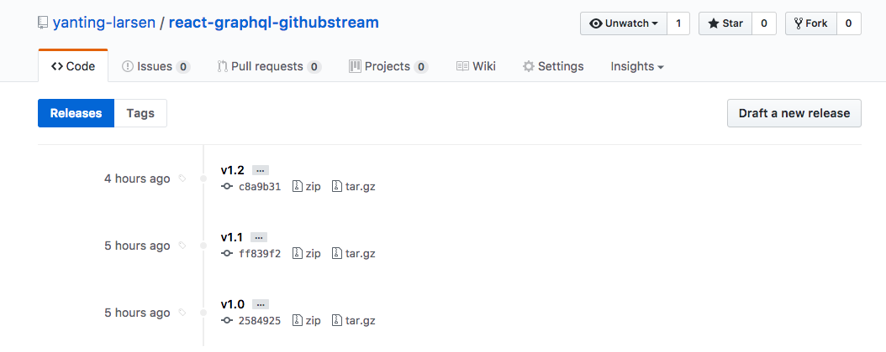
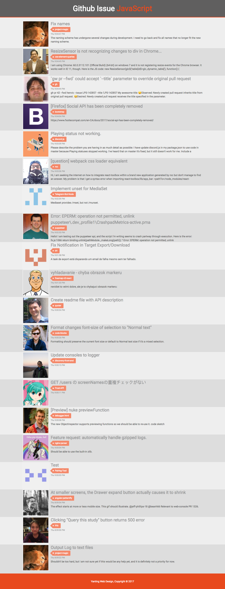
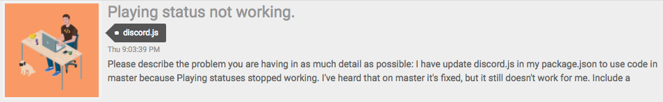
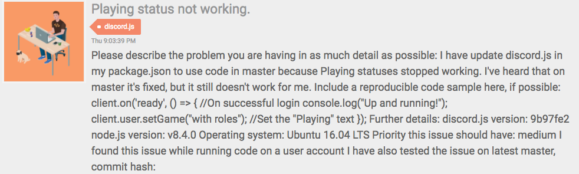

# Background

In this task, we would like to have a client that, for example, lists all Github issues that concerns javascript. Given the following GraphQL-snippet

```
{
  search(query: "language:JavaScript", type: ISSUE, first: 20) {
    nodes {
      ... on Issue {
        createdAt
        title
        url
        repository {
          url
        }
        author {
          avatarUrl
          url
        }
      }
    }
  }
}
```

we will get a list of issues. To compare with another stream such as Twitter, it could be displayed in this manner on a narrow display (i.e. mobile)

```
+-------------------+   ^ latest
|     | Title       |   |
| img | Text        |   |
|     | CreatedAt   |   |
+-------------------+   |
         |              |
         |              |
+-------------------+   |
|     | Title       |   |
| img | Text        |   |
|     | CreatedAt   |   |
+-------------------+   |
         |              |
         |              |
+-------------------+   |
|     | Title       |   |
| img | Text        |   |
|     | CreatedAt   |   |
+-------------------+   + oldest
```

# Task

Version 1.0
Create an application that shows the latest issues, newest first. 

Version 1.1
Improve on the UI.

Version 1.2
Add streaming functionality.

# How to run application

Each version can be accessed by checking out the corresponding tag

1. Run `webpack` to build assets.
2. run `npm start` to start a web server that serves the public folder.
3. Browse to `localhost:8000/?token={your Github token}`.
4. Watch the issues as they come every 5 seconds.




# Result

1. Full page


2. Tag mouse over


3. Text mouse over

